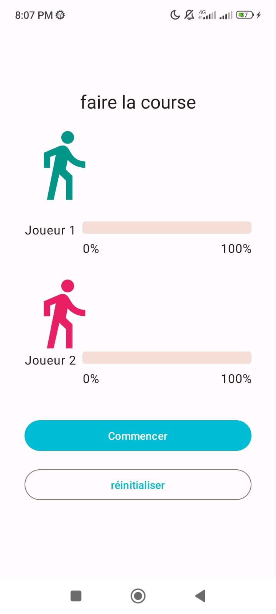
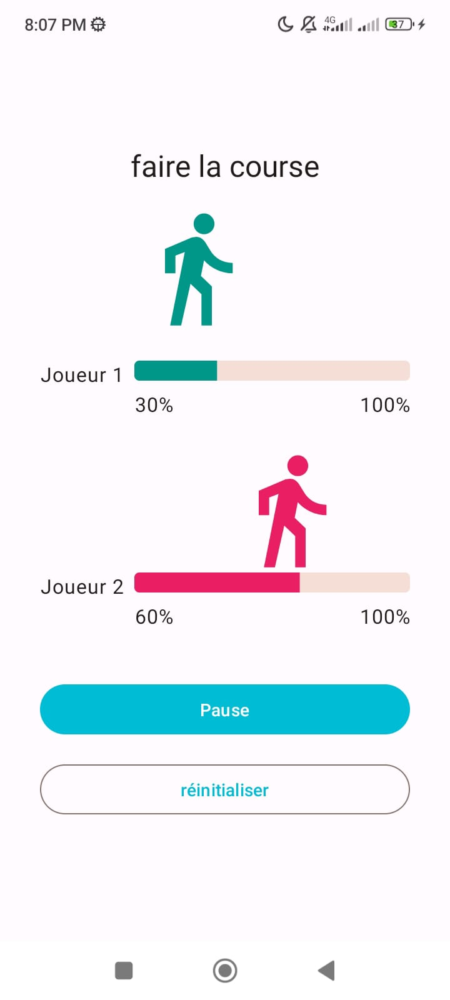

# Applications des coroutines
## Vue d'ensemble
Race Tracker est une application Android développée en utilisant Jetpack Compose. Elle simule une course simple entre deux participants, permettant à l'utilisateur de démarrer, mettre en pause et réinitialiser la course. L'application démontre l'utilisation des animations, la gestion d'état et les éléments d'interface utilisateur dans Compose.


## Fonctionnalités
```
* Simulation de course : Deux participants concourent l'un contre l'autre, avec un affichage de la progression en temps réel.
* Panneau de contrôle : Les utilisateurs peuvent démarrer, mettre en pause et réinitialiser la course.
* Indicateurs de progression : Des indicateurs visuels montrent la progression actuelle de chaque participant.
* Icônes animées : Les icônes des participants se déplacent selon leur progression dans la course.
* Détails techniques
* Langage : Kotlin 
* Boîte à outils UI : Jetpack Compose
* Gestion d'état : Utilise remember et mutableStateOf pour la gestion d'état.
* Animation : Utilise animateDp et updateTransition pour des animations d'icônes fluides.
```
## Configuration
```
* Clonez le dépôt sur votre machine locale.
* Ouvrez le projet dans Android Studio.
* Exécutez l'application sur un émulateur ou un appareil physique.
```
## Structure
```
* RaceTrackerApp(): La fonction composable principale qui orchestre la course.
* RaceTrackerScreen(): Affiche les participants à la course, les indicateurs de progression et les boutons de contrôle.
* StatusIndicator(): Affiche le nom et la progression de chaque participant.
* RaceControls(): Contient les boutons pour contrôler l'état de la course.
* IconAnimation(): Anime les icônes des participants en fonction de leur progression.
```
## Comment utiliser
```
* Appuyez sur le bouton 'Démarrer' pour commencer la course.
* Utilisez le bouton 'Pause' pour mettre la course en pause à tout moment.
* Appuyez sur 'Réinitialiser' pour remettre la progression des deux participants à zéro.
```

